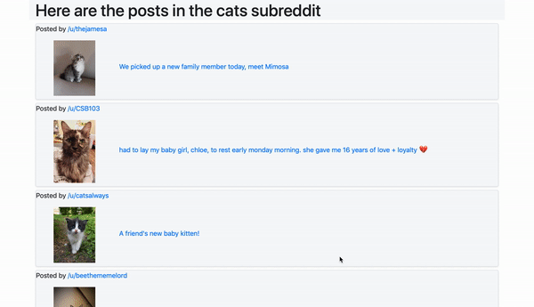

# README

To Do
- [x] localhost/r/cats should display the post titles and pictures from r/cats
- [x] transform reddit API response into domain specific data structure
- [x] style with bootstrap
- [x] Add Users
- [x] Make Users posts page
- [x] Add Comments
- [ ] Make Users comments page

